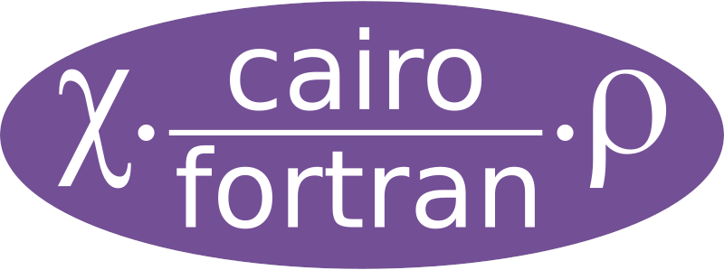
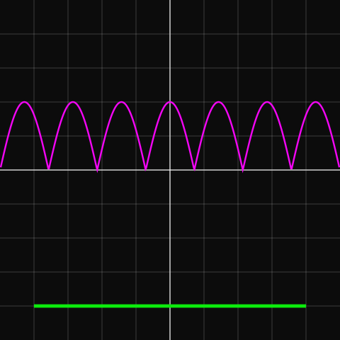

# cairo-fortran



This repository contains Fortran bindings for the [Cairo](https://cairographics.org/) vector graphics library. It was extracted from the [gtk-fortran](https://github.com/vmagnin/gtk-fortran/wiki/) project, as a separate _fpm_ package, for people who don't need the GTK stuff.

Remark: this repository was cloned from the now unavailable @brocolis' repository (latest 5th September 2021 version).

## Requirements and dependencies

You need:

* a modern Fortran compiler, for example GFortran or the Intel ifort/ifx compilers. See the [Fortran-lang.org compilers page](https://fortran-lang.org/compilers/) for other compilers.
* The Cairo development files (`libcairo2-dev` package in Ubuntu).
* The Fortran Package Manager [fpm](https://fpm.fortran-lang.org/).

### Installation in Linux

For example, in Ubuntu:
```bash
$ sudo apt install gfortran libcairo2-dev
```

Concerning fpm, see the [fpm documentation](https://fpm.fortran-lang.org/en/install/index.html).

If you have a GitHub account, just clone the repository:

```
$ git clone git@github.com:vmagnin/cairo-fortran.git
$ cd cairo-fortran
```

### Installation in Windows

You can use for example the [MSYS2](http://www.msys2.org/) environment:
* https://packages.msys2.org/base/mingw-w64-cairo
* https://packages.msys2.org/base/mingw-w64-fpm

Install the following packages via the MSYS2-MSYS shell:
  * build tools: 
    * `$ pacman -S mingw-w64-ucrt-x86_64-toolchain base-devel` (it will install gcc, gdb, gfortran, python, make, pkgconf...)
  * git: 
    * `$ pacman -S git`
  * Cairo and its dependencies: 
    * `$ pacman -S mingw-w64-ucrt-x86_64-cairo`
  * Fortran Package Manager fpm: 
    * `$ pacman -S mingw-w64-ucrt-x86_64-fpm`

Then start the MSYS2-UCRT64 shell.

If you have a GitHub account, just clone the repository:

```
$ git clone git@github.com:vmagnin/cairo-fortran.git
$ cd cairo-fortran
```

## Testing cairo-fortran

Each test prints nothing in the terminal but creates an output file in the main directory of the project: `test1.f90` a PNG file, `test2.f90` a SVG file and `test4.f90` a PDF file.

```bash
$ fpm test
cairo-auto.f90                         done.
cairo-enums.f90                        done.
cairo-types.f90                        done.
libcairo-fortran.a                     done.
test4.f90                              done.
test1.f90                              done.
test2.f90                              done.
test4                                  done.
test1                                  done.
test2                                  done.
[100%] Project compiled successfully.
$ ls *.png *.svg *.pdf
axis.svg  chess.pdf  F.png
```

Note that Cairo has many other rendering devices not tested here (e.g. PostScript). See https://cairographics.org/manual/cairo-surfaces.html for other available *surfaces*.

### Example test1


### Example test2


### Example test4


### Other examples

These examples use cairo-fortran as a fpm dependency:
* https://github.com/vmagnin/hat_polykite
* https://github.com/vmagnin/von_koch_snowflake
* https://github.com/vmagnin/penrose_tiling

## fpm
To use cairo-fortran within your own `fpm` project, add the following dependency to your project `fpm.toml` file:

```toml
[dependencies]
cairo-fortran = {git = "https://github.com/vmagnin/cairo-fortran" }
```

## License

Cairo-fortran is licensed under the [GNU General Public License version 3 or later](http://www.gnu.org/licenses/gpl.html), with the additional permissions described in the [GCC Runtime Library Exception version 3.1](https://www.gnu.org/licenses/gcc-exception-3.1.en.html).

## Cairo documentation and tutorials

* https://cairographics.org/documentation/
    * API Reference Manual: https://cairographics.org/manual/
* A [Cairo graphics tutorial](https://zetcode.com/gfx/cairo/).


## Original project
* Origin: [gtk-fortran project](https://github.com/vmagnin/gtk-fortran/)
> Vincent MAGNIN, James TAPPIN, Jens HUNGER, Jerry DE LISLE, "gtk-fortran: a GTK+ binding to build Graphical User Interfaces in Fortran", _Journal of Open Source Software,_ 4(34), 1109, 12th January 2019, [https://doi.org/10.21105/joss.01109](https://doi.org/10.21105/joss.01109)

